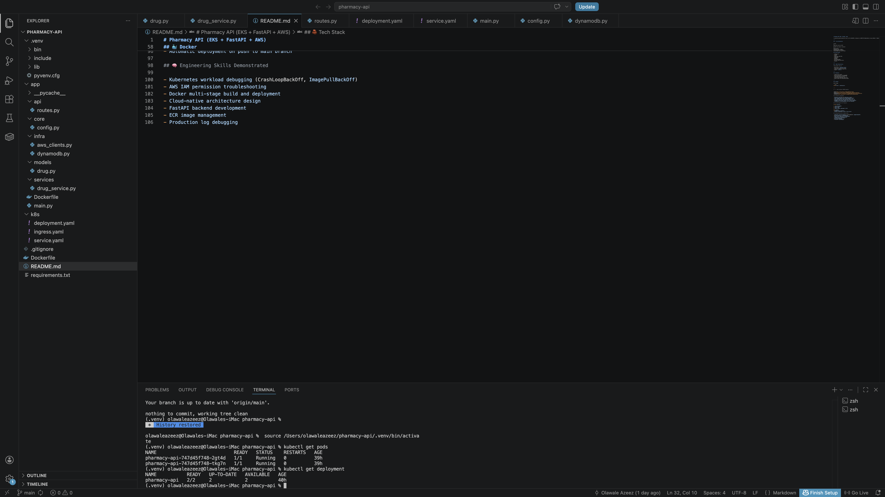
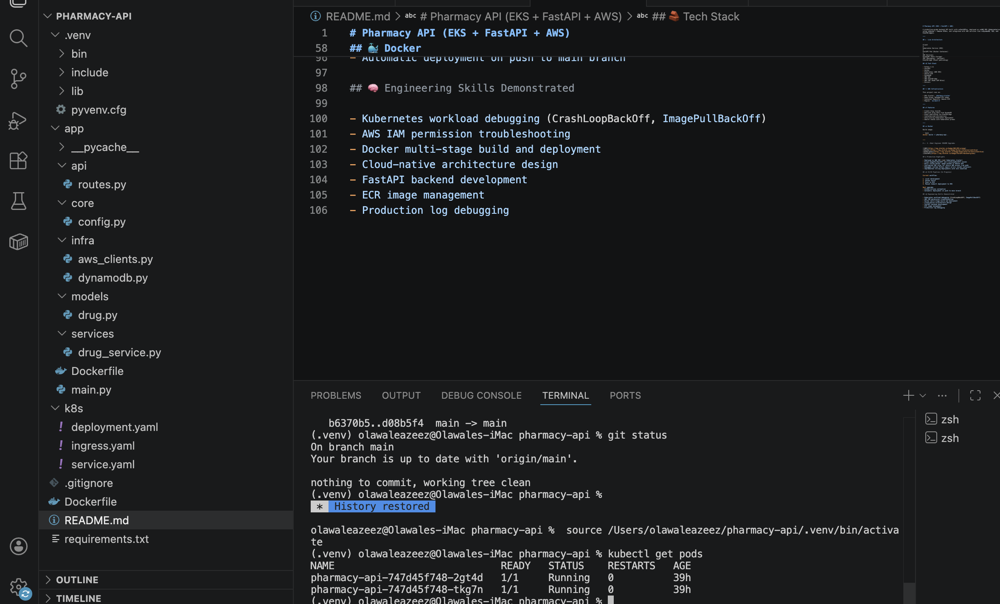
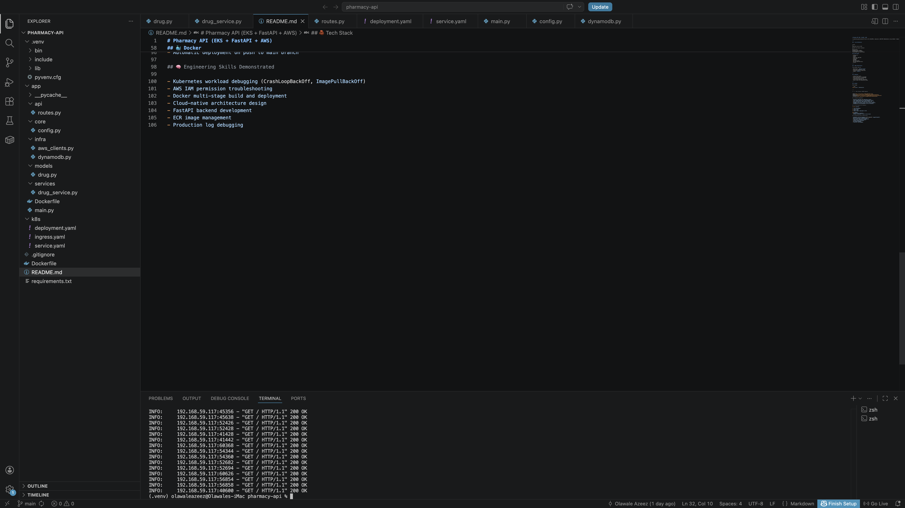

# Pharmacy API (AWS EKS + FastAPI + Kubernetes)


## Overview

A production-grade backend API built with **FastAPI**, containerized with **Docker**, and deployed on **Amazon EKS (Kubernetes)**. The application integrates with AWS services including **DynamoDB**, **Amazon ECR**, **SQS**, and **EventBridge** to demonstrate cloud-native application deployment and modern platform engineering practices.

This project showcases the end-to-end process of building, containerizing, deploying, and operating a Kubernetes-based microservice on AWS.

---

## Architecture

```text
Client
   │
   ▼

Kubernetes Service (EKS)
   │
   ▼

FastAPI Application Pod
   │
   ├── DynamoDB
   ├── EventBridge
   └── Amazon SQS

```

---

## Deployment Screenshots

### Amazon EKS Cluster

Production Kubernetes cluster running on AWS EKS.


---

### Kubernetes Deployment

Deployment health showing all replicas available and serving traffic.



---

### Running Pods

FastAPI application pods successfully deployed and running within the EKS cluster.



---

### Application Logs

Application logs confirming successful request processing and service availability.



---

## Tech Stack

### Backend

* Python 3.11
* FastAPI
* Uvicorn

### Containerization

* Docker
* Amazon ECR

### Orchestration

* Kubernetes
* Amazon EKS

### AWS Services

* DynamoDB
* Amazon SQS
* Amazon EventBridge
* IAM Roles
* CloudWatch

---

## AWS Infrastructure

| Component          | Service                  |
| ------------------ | ------------------------ |
| Container Platform | Amazon EKS               |
| Container Registry | Amazon ECR               |
| Compute            | Managed EC2 Worker Nodes |
| Database           | DynamoDB                 |
| Messaging          | Amazon SQS               |
| Event Processing   | Amazon EventBridge       |
| Identity & Access  | AWS IAM                  |
| Monitoring         | CloudWatch               |

**Region:** `eu-west-2`

---

## Features

* Create and retrieve pharmacy drug records
* Store application data in DynamoDB
* Publish events to Amazon EventBridge
* Containerized FastAPI application
* Kubernetes-based deployment
* Health checks and readiness probes
* Scalable microservice architecture
* AWS-native integration

---

## Docker

Build the application image:

```bash
docker build -t pharmacy-api .
```

Run locally:

```bash
docker run -p 8000:8000 pharmacy-api
```

---

## Kubernetes Deployment

Deploy application resources:

```bash
kubectl apply -f k8s/
```

Verify deployments:

```bash
kubectl get deployments
kubectl get pods
kubectl get services
```

---

## Production Engineering Highlights

This project demonstrates practical cloud engineering and Kubernetes operations experience:

* Deployed workloads to a real Amazon EKS cluster
* Built and managed Docker container images
* Published images to Amazon ECR
* Configured Kubernetes deployments and services
* Integrated AWS services with application workloads
* Implemented health checks and deployment strategies
* Troubleshot ImagePullBackOff issues
* Resolved CrashLoopBackOff failures
* Debugged container runtime and Python import errors
* Configured IAM permissions for Kubernetes workloads
* Validated application health through Kubernetes logs and monitoring

---

## Engineering Skills Demonstrated

### Cloud Engineering

* AWS Infrastructure
* Amazon EKS
* Amazon ECR
* DynamoDB Integration
* IAM Configuration
* Event-Driven Architecture

### Kubernetes

* Deployments
* Services
* Pod Management
* Container Debugging
* Health Checks
* Workload Troubleshooting

### DevOps

* Docker Containerization
* Infrastructure Automation
* Cloud-Native Architecture
* Operational Troubleshooting
* Production Monitoring

### Backend Development

* Python
* FastAPI
* REST API Development
* Event Publishing
* Data Persistence

---

## Repository Structure

```text
.
├── app/
│   ├── api/
│   ├── core/
│   ├── infra/
│   ├── models/
│   └── services/
├── docs/
│   ├── eks-cluster.png
│   ├── deployment-status.png
│   ├── kubernetes-pods.png
│   └── application-logs.png
├── k8s/
│   ├── deployment.yaml
│   ├── service.yaml
│   └── ingress.yaml
├── Dockerfile
├── requirements.txt
└── README.md
```

---

## Future Improvements

* GitHub Actions CI/CD Pipeline
* Automated EKS Deployments
* Terraform Infrastructure Provisioning
* Horizontal Pod Autoscaling
* Prometheus Monitoring
* Grafana Dashboards
* Blue/Green Deployments
* OpenTelemetry Observability

---

## Why This Project Matters

Modern organizations rely on Kubernetes and cloud-native platforms to deliver scalable and resilient applications. This project demonstrates the practical skills required to deploy, operate, troubleshoot, and manage production workloads on AWS using Kubernetes and modern DevOps practices.

---

## Author

**Olawale Azeez**

Cloud Engineer | Platform Engineer | AWS Solutions Architect

Focused on AWS, Kubernetes, Platform Engineering, Cloud Infrastructure, Developer Experience, and Cloud-Native Application Delivery.
