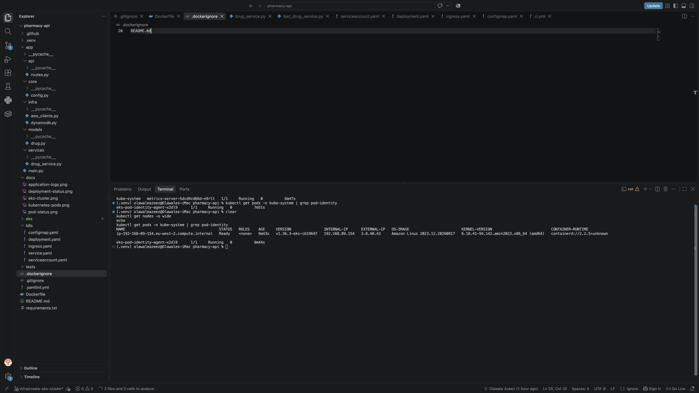
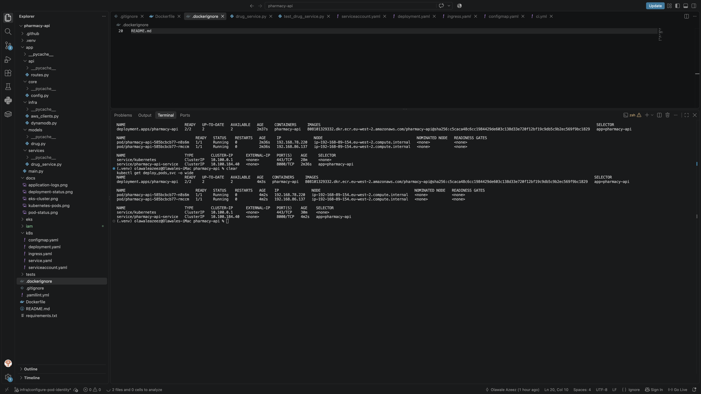
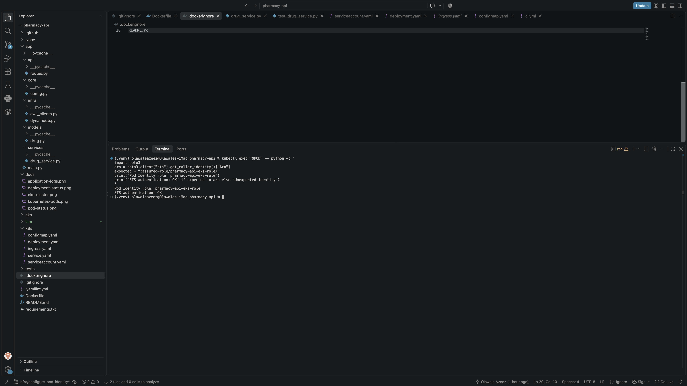
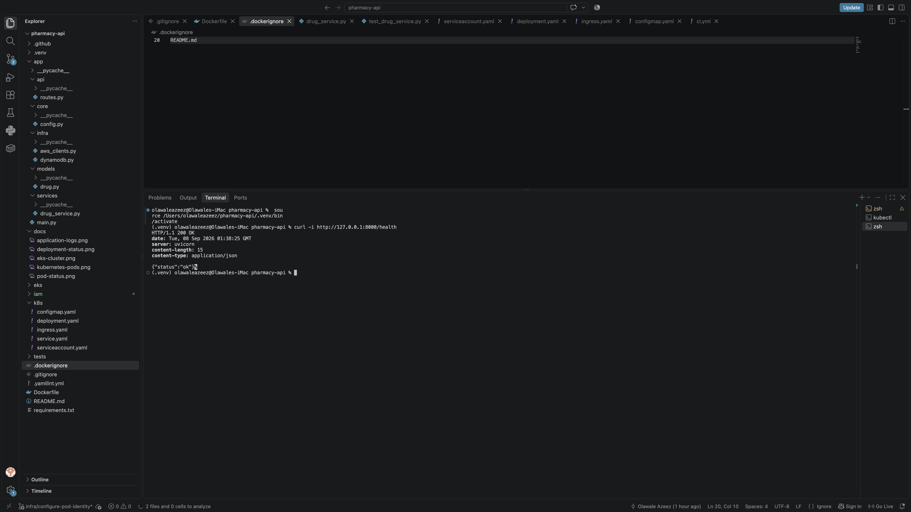
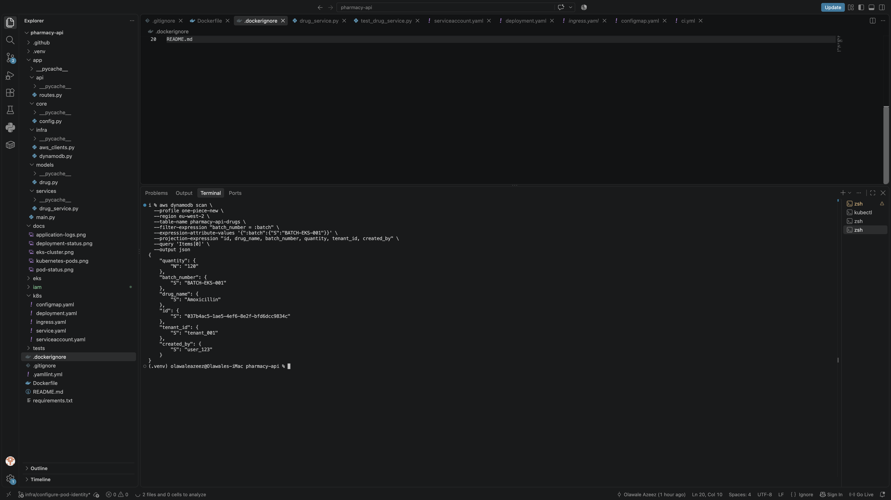
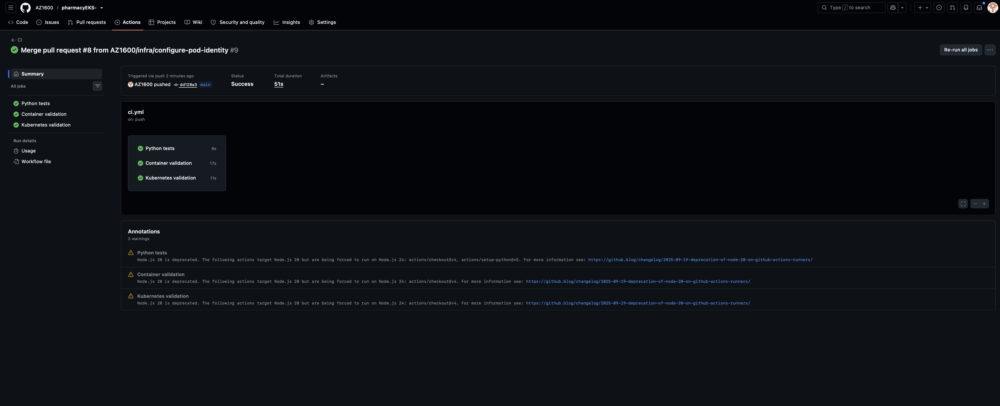

# Pharmacy API on Amazon EKS


A cloud-native FastAPI workload deployed and validated on a real Amazon EKS cluster.

The project focuses on Kubernetes workload engineering, container security, AWS workload identity, immutable container delivery, DynamoDB persistence, event publishing, and automated CI validation.

---

## Architecture

```text
Client
  │
  ▼
Kubernetes Service
  │
  ▼
Amazon EKS
  │
  └── pharmacy-api Deployment
        │
        ├── FastAPI Pod
        ├── FastAPI Pod
        │
        ├── EKS Pod Identity
        │     └── pharmacy-api-eks-role
        │
        ├── DynamoDB
        │     └── pharmacy-api-drugs
        │
        └── EventBridge
              └── DrugCreated event


Container Delivery

Docker
  │
  ▼
Amazon ECR
  │
  ▼
Immutable SHA256 Image Digest
  │
  ▼
EKS Deployment
```

**AWS Region:** `eu-west-2`

---

## What Was Validated

This repository was deployed and tested against a live Amazon EKS environment.

The validation included:

- Amazon EKS cluster with a managed EC2 worker node
- Kubernetes 1.36 workload deployment
- two FastAPI replicas running successfully
- immutable Amazon ECR image deployment using a SHA256 digest
- hardened non-root container execution
- readiness and liveness probes using `/health`
- EKS Pod Identity with a dedicated least-privilege IAM role
- successful STS authentication from inside a running Pod
- successful HTTP health check
- real API request through the deployed EKS workload
- successful DynamoDB persistence
- EventBridge event publishing from the application workflow
- GitHub Actions validation for Python, containers, and Kubernetes manifests

---

# Deployment Evidence

## Amazon EKS Cluster

The managed worker node reached `Ready` state and the EKS Pod Identity Agent was running successfully.



---

## Running Kubernetes Workload

The FastAPI deployment runs two replicas on Amazon EKS using an immutable Amazon ECR image digest.



---

## EKS Pod Identity

The running application Pod successfully authenticated through the dedicated `pharmacy-api-eks-role`.

No long-lived AWS credentials are mounted into the workload.



---

## Application Health

The deployed application returned HTTP `200 OK` from the `/health` endpoint.



---

## DynamoDB Persistence

A drug record submitted through the running EKS workload was successfully persisted to the `pharmacy-api-drugs` DynamoDB table.



---

## Continuous Integration

GitHub Actions validates the application, hardened container, and Kubernetes configuration.



---

# Security Engineering

The container and Kubernetes workload use several defense-in-depth controls.

## Container Security

- runs as the non-root `appuser`
- minimal Python slim base image
- reduced Docker build context using `.dockerignore`
- local development files excluded from the image
- no local virtual environment copied into the image
- runtime validated with all Linux capabilities dropped
- runtime validated with `no-new-privileges`
- runtime validated with a read-only root filesystem
- temporary writable storage limited to `/tmp`

---

## Kubernetes Security

The Kubernetes workload includes:

- `runAsNonRoot: true`
- fixed non-root UID and GID
- `allowPrivilegeEscalation: false`
- `readOnlyRootFilesystem: true`
- all Linux capabilities dropped
- `RuntimeDefault` seccomp profile
- CPU and memory requests
- CPU and memory limits
- readiness probes
- liveness probes
- memory-backed `/tmp`
- rolling update strategy
- dedicated `pharmacy-api` ServiceAccount

---

## AWS Workload Identity

The application uses **Amazon EKS Pod Identity** rather than long-lived AWS access keys.

The Kubernetes ServiceAccount:

```text
pharmacy-api
```

is associated with the IAM role:

```text
pharmacy-api-eks-role
```

The workload IAM role is restricted to the required runtime permissions.

### DynamoDB

```text
dynamodb:GetItem
dynamodb:PutItem
```

Access is restricted to:

```text
pharmacy-api-drugs
```

### EventBridge

```text
events:PutEvents
```

Access is restricted to the required EventBridge event bus.

No AWS access key or secret access key is stored inside the Kubernetes workload.

---

# Application Flow

Creating a drug follows this path:

```text
POST /drugs
    │
    ▼
FastAPI Route
    │
    ▼
Drug Service
    │
    ├── Generate Record ID
    │
    ├── Attach Tenant/User Context
    │
    ├── Persist Record to DynamoDB
    │
    └── Publish DrugCreated Event
    │
    ▼
Amazon EventBridge
```

Example request:

```bash
curl -X POST http://127.0.0.1:8000/drugs \
  -H 'Content-Type: application/json' \
  -d '{
    "drug_name": "Amoxicillin",
    "batch_number": "BATCH-EKS-001",
    "quantity": 120,
    "reorder_level": 25,
    "expiry_date": "2027-12-31",
    "supplier": "Portfolio Pharma"
  }'
```

Example successful response:

```json
{
  "message": "Drug created successfully",
  "data": {
    "drug_name": "Amoxicillin",
    "batch_number": "BATCH-EKS-001",
    "quantity": 120,
    "reorder_level": 25,
    "expiry_date": "2027-12-31",
    "supplier": "Portfolio Pharma",
    "tenant_id": "tenant_001",
    "created_by": "user_123"
  }
}
```

---

# Authentication Scope

This repository currently focuses on EKS workload engineering rather than production application authentication.

The application currently uses demo tenant and user claims:

```text
tenant_id: tenant_001
user_id: user_123
```

These values demonstrate tenant-aware record creation but are not production authentication.

A production implementation should replace the demo claim provider with validated identity claims from:

- Amazon Cognito
- another OIDC provider
- JWT-based authentication

This limitation is intentionally documented rather than presented as completed production authentication.

---

# Continuous Integration

The GitHub Actions workflow runs on pull requests and pushes to `main`.

It validates three areas.

## Python Tests

```text
Install dependencies
        │
        ▼
Compile application modules
        │
        ▼
Run unit tests
```

## Container Validation

```text
Build Docker image
        │
        ▼
Verify non-root image user
        │
        ▼
Run hardened container
        │
        ├── Read-only filesystem
        ├── Drop all capabilities
        ├── no-new-privileges
        └── Memory-backed /tmp
        │
        ▼
Verify /health
        │
        ▼
Confirm runtime UID is non-root
```

## Kubernetes Validation

```text
Kubernetes YAML
      │
      ├── yamllint
      │
      └── kubeconform
```

This provides automated validation before changes reach `main`.

---

# EKS Infrastructure

The repository includes an `eksctl` cluster definition:

```text
eks/cluster.yaml
```

The cluster configuration defines:

- cluster name: `pharmacy-eks`
- AWS region: `eu-west-2`
- Kubernetes 1.36
- managed EC2 node group
- `t3.medium` worker node
- desired capacity of 1
- minimum capacity of 1
- maximum capacity of 2
- EKS Pod Identity Agent add-on
- project and environment tags

Create the cluster with:

```bash
eksctl create cluster -f eks/cluster.yaml
```

Verify the nodes:

```bash
kubectl get nodes -o wide
```

Verify the Pod Identity Agent:

```bash
kubectl get pods -n kube-system | grep pod-identity
```

---

# Kubernetes Deployment

Deploy the application resources:

```bash
kubectl apply -f k8s/
```

Wait for the deployment:

```bash
kubectl rollout status deployment/pharmacy-api
```

Inspect the workload:

```bash
kubectl get deploy,pods,svc -o wide
```

Expected state:

```text
deployment/pharmacy-api   2/2 Available

pod/pharmacy-api-...      1/1 Running
pod/pharmacy-api-...      1/1 Running
```

---

# Health Validation

The Kubernetes service currently uses `ClusterIP`.

For local validation:

```bash
kubectl port-forward service/pharmacy-api-service 8000:8000
```

Then:

```bash
curl -i http://127.0.0.1:8000/health
```

Expected result:

```text
HTTP/1.1 200 OK
```

```json
{
  "status": "ok"
}
```

---

# Docker

Build the application:

```bash
docker build -t pharmacy-api .
```

Run locally:

```bash
docker run \
  --rm \
  --name pharmacy-api \
  --publish 8000:8000 \
  pharmacy-api
```

The hardened runtime was also validated with:

```bash
docker run \
  --rm \
  --publish 8000:8000 \
  --read-only \
  --cap-drop ALL \
  --security-opt no-new-privileges:true \
  --tmpfs /tmp:rw,noexec,nosuid,size=16m \
  pharmacy-api
```

---

# Amazon ECR

The application container is stored in Amazon ECR.

The Kubernetes Deployment references an immutable image digest rather than a mutable `latest` tag.

Example:

```text
pharmacy-api@sha256:...
```

This ensures the Kubernetes Deployment references an exact container artifact.

---

# DynamoDB

Application records are stored in:

```text
pharmacy-api-drugs
```

The table uses:

```text
Partition Key: id
Type: String
Billing Mode: PAY_PER_REQUEST
```

A real record submitted through the deployed EKS application was successfully persisted and verified directly in DynamoDB.

---

# IAM Configuration

The repository contains the workload IAM configuration under:

```text
iam/
├── pharmacy-api-policy.json
└── pod-identity-trust.json
```

The trust policy restricts Pod Identity usage to:

```text
Cluster:        pharmacy-eks
Namespace:      default
ServiceAccount: pharmacy-api
```

The runtime policy grants only the AWS permissions required by the application.

---

# Repository Structure

```text
.
├── .github/
│   └── workflows/
│       └── ci.yml
│
├── app/
│   ├── api/
│   │   └── routes.py
│   ├── core/
│   │   └── config.py
│   ├── infra/
│   │   ├── aws_clients.py
│   │   └── dynamodb.py
│   ├── models/
│   │   └── drug.py
│   ├── services/
│   │   └── drug_service.py
│   └── main.py
│
├── docs/
│   ├── dynamodb-persistence.png
│   ├── eks-cluster-ready.png
│   ├── github-actions-ci.png
│   ├── health-check.png
│   ├── pharmacy-workload-running.png
│   └── pod-identity-proof.png
│
├── eks/
│   └── cluster.yaml
│
├── iam/
│   ├── pharmacy-api-policy.json
│   └── pod-identity-trust.json
│
├── k8s/
│   ├── configmap.yaml
│   ├── deployment.yaml
│   ├── ingress.yaml
│   ├── service.yaml
│   └── serviceaccount.yaml
│
├── tests/
│   └── test_drug_service.py
│
├── .dockerignore
├── .gitignore
├── .yamllint.yml
├── Dockerfile
├── requirements.txt
└── README.md
```

---

# Engineering Skills Demonstrated

## AWS

- Amazon EKS
- Amazon ECR
- DynamoDB
- EventBridge
- AWS IAM
- EKS Pod Identity
- EC2 managed worker nodes

## Kubernetes

- Deployments
- Services
- ServiceAccounts
- readiness probes
- liveness probes
- rolling updates
- workload security contexts
- resource requests and limits
- seccomp
- container capability reduction
- Kubernetes manifest validation

## Container Engineering

- Docker
- non-root containers
- immutable images
- read-only root filesystems
- Linux capability reduction
- restricted writable filesystem paths
- reduced Docker build contexts

## DevOps

- GitHub Actions
- pull request workflows
- automated Python tests
- container validation
- Kubernetes YAML linting
- Kubernetes schema validation
- deployment verification

## Backend Engineering

- Python
- FastAPI
- boto3
- REST APIs
- DynamoDB persistence
- EventBridge event publishing
- tenant-aware application data

---

# Current Limitations

The project intentionally documents areas that still require further engineering.

Current limitations include:

- application identity claims are currently demo values
- production JWT validation has not yet been implemented
- DynamoDB tenant isolation is currently application-level rather than enforced through the key design
- the EventBridge bus is currently configured as `default`
- the current ingress configuration requires a compatible ingress controller
- full external production ingress has not yet been configured
- full application observability has not yet been implemented

---

# Next Improvements

Potential next iterations include:

- Amazon Cognito or OIDC/JWT authentication
- DynamoDB tenant-aware partition key design
- EventBridge configuration through environment variables
- EventBridge failure handling
- Kubernetes NetworkPolicies
- PodDisruptionBudget
- Horizontal Pod Autoscaling
- AWS Load Balancer Controller
- Prometheus metrics
- Grafana dashboards
- CloudWatch alarms
- OpenTelemetry tracing
- end-to-end integration tests
- automated AWS infrastructure provisioning
- deployment automation from CI/CD
- SBOM generation
- image signing and provenance

---

# Purpose

This repository is an **Amazon EKS workload engineering case study**.

It demonstrates how a Python API can be:

- containerized with Docker
- hardened to run as a non-root workload
- published to Amazon ECR
- deployed using an immutable image digest
- operated on Amazon EKS
- granted least-privilege AWS permissions through EKS Pod Identity
- connected to DynamoDB and EventBridge
- validated against real AWS services
- tested through a live application request
- protected by automated CI checks

The focus is on practical Cloud Engineering, Platform Engineering, Kubernetes operations, AWS workload security, and cloud-native application delivery.

---

# Author

**Olawale Azeez**

Cloud Engineer | Platform Engineer | AWS Certified Developer – Associate

AWS • Kubernetes • Platform Engineering • Cloud Infrastructure • DevOps • Cloud-Native Application Delivery